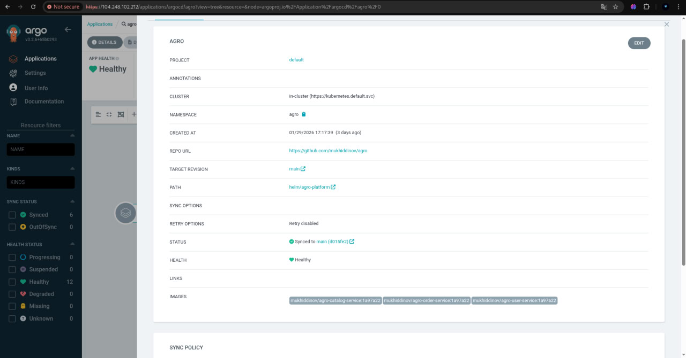
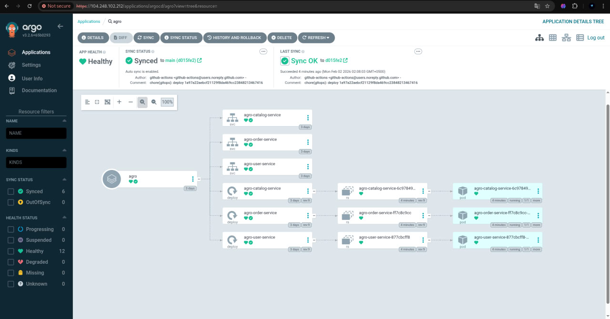
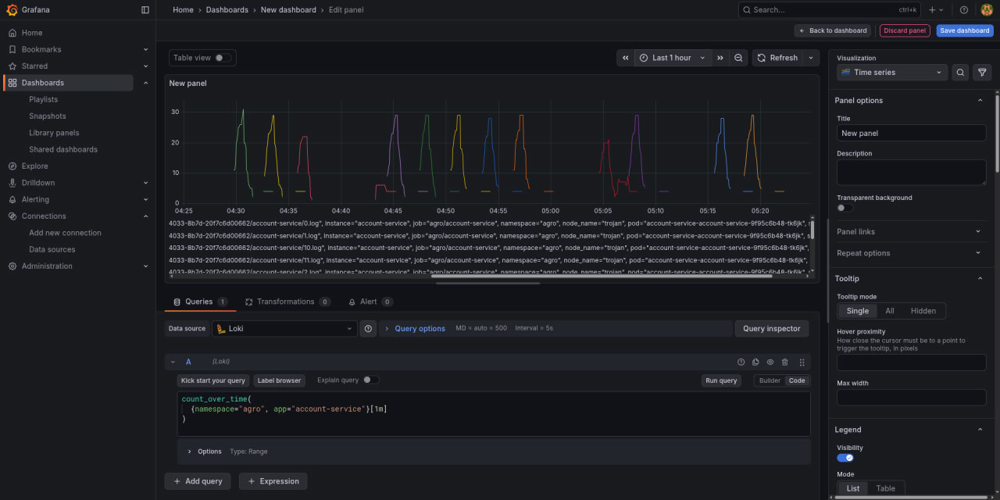
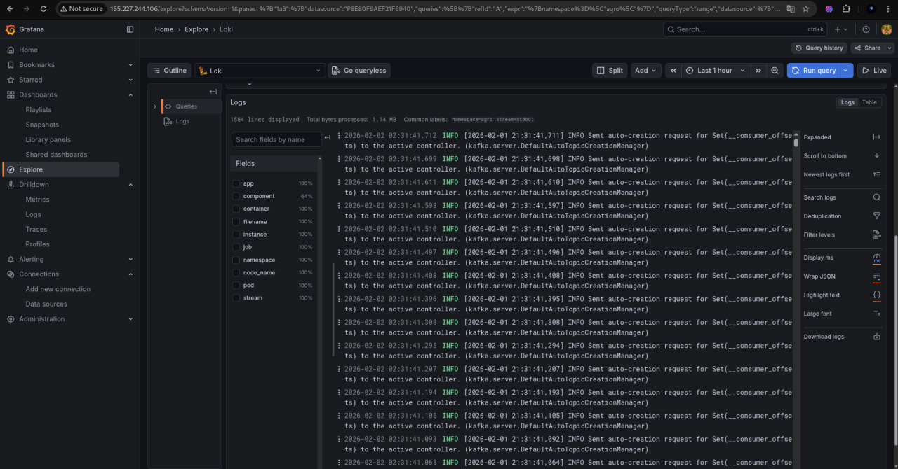

# Agro Platform — Microservices + GitOps

## Overview
Agro Platform is a Java/Spring microservices system deployed to Kubernetes via a **single umbrella Helm chart** and **GitOps with Argo CD**. Container images are built in CI and pushed to **Docker Hub** under `mukhiddinov`, using `latest` for runtime and an immutable short SHA for traceability.

**Key components**
- Microservices: account, cart, catalog, checkout, inventory, order, payment, pricing, shipping, user
- Deployment: Helm umbrella chart at `helm/agro-platform`
- GitOps: Argo CD Applications in `argocd/`
- Observability: Prometheus + Grafana + Loki (Helm values in `monitoring/`)
- Kubernetes: DigitalOcean DOKS

## Repository layout
- `helm/agro-platform/`: umbrella chart used by Argo CD
- `argocd/`: Argo CD Application manifests
- `monitoring/`: Helm values for Prometheus, Grafana, Loki
- `Dockerfile`: multi-stage build, supports `--build-arg SERVICE_NAME=<service>`
- `docker-compose.yml`: local PostgreSQL + Kafka

Note: legacy per-service Helm charts still exist under `helm/*` (e.g., `helm/cart-service`) but are **not used**. Only `helm/agro-platform` is supported.

## Prerequisites
- `kubectl`
- `helm`
- `docker`
- `doctl` (DigitalOcean CLI)
- `argocd` CLI (optional)

## Local development (optional)
Start PostgreSQL and Kafka:
```bash
docker compose up -d
```

Build all services:
```bash
mvn clean install
```

Build a single service:
```bash
mvn -pl order-service -am package
```

Build a local image:
```bash
docker build --build-arg SERVICE_NAME=order-service -t mukhiddinov/agro-order-service:local .
```

Run a service locally:
```bash
mvn -pl order-service spring-boot:run
```

## CI/CD pipeline (GitHub Actions)
Workflow: `.github/workflows/ci.yml`

**What it does**
- Matrix build for all services
- Builds Docker images using `--build-arg SERVICE_NAME=<service>`
- Tags and pushes to Docker Hub only on `main`
- Tags: `latest` and `<short-sha>`
- No Helm values changes per-commit (GitOps is handled by Argo CD + Image Updater)

**Image naming**
- `mukhiddinov/agro-<service>:latest`
- `mukhiddinov/agro-<service>:<short-sha>`

## Deployment to DigitalOcean DOKS
### 1) Configure kubeconfig
```bash
doctl kubernetes cluster kubeconfig save <cluster-name>
```

### 2) Create namespace
```bash
kubectl create namespace agro
```

### 3) Install Argo CD
```bash
kubectl create namespace argocd
kubectl apply -n argocd -f https://raw.githubusercontent.com/argoproj/argo-cd/stable/manifests/install.yaml
```

### 4) Create Argo CD Applications
This repo includes:
- `argocd/agro-platform-stage.yaml`
- `argocd/agro-platform-prod.yaml`

Apply them:
```bash
kubectl apply -n argocd -f argocd/agro-platform-stage.yaml
kubectl apply -n argocd -f argocd/agro-platform-prod.yaml
```

**Note:** these manifests currently target `agro-stage` and `agro-prod` namespaces. If you want a single namespace (`agro`) update the `spec.destination.namespace` fields accordingly.

### 5) Enable auto-sync
Auto-sync (prune + self-heal) is already set in `argocd/agro-platform-stage.yaml`.

## Helm chart configuration
Umbrella chart path: `helm/agro-platform`

**Defaults**
- `global.image.repositoryPrefix`: `mukhiddinov/agro`
- `global.image.tag`: `latest`
- `global.image.pullPolicy`: `Always`

**Image resolution**
```
{{ .Values.global.image.repositoryPrefix }}-{{ serviceName }}:{{ tag }}
```

Per-service overrides are allowed but optional.

## Datastores and required env vars
### PostgreSQL
Default DB names (per service):

| Service | Database |
|---|---|
| account-service | accountdb |
| cart-service | cartdb |
| catalog-service | catalogdb |
| checkout-service | checkoutdb |
| inventory-service | inventorydb |
| order-service | orderdb |
| payment-service | paymentdb |
| pricing-service | pricingdb |
| shipping-service | shippingdb |
| user-service | userdb |

Recommended service endpoint (DOKS):
- `postgresql.agro.svc.cluster.local:5432`

### Kafka
Recommended service endpoint (DOKS):
- `kafka.agro.svc.cluster.local:9092`

### Required environment variables
Set these via Helm `services.<name>.env` or global `env`:

| Variable | Example | Notes |
|---|---|---|
| `SPRING_DATASOURCE_URL` | `jdbc:postgresql://postgresql.agro.svc.cluster.local:5432/orderdb` | Overrides per-service defaults in `application.yml` |
| `SPRING_DATASOURCE_USERNAME` | `agro` | Defaults to `agro` |
| `SPRING_DATASOURCE_PASSWORD` | `agro123` | Defaults to `agro123` |
| `KAFKA_BOOTSTRAP_SERVERS` | `kafka.agro.svc.cluster.local:9092` | Required by Kafka-enabled services (account, catalog, inventory, order, payment); safe to set globally |

## Observability (Prometheus + Grafana + Loki)
Helm values are provided in `monitoring/`.

### Install Prometheus
```bash
helm repo add prometheus-community https://prometheus-community.github.io/helm-charts
helm repo update
helm upgrade --install prometheus prometheus-community/prometheus \
  --namespace monitoring --create-namespace \
  -f monitoring/prometheus-values.yaml
```

### Install Loki + Promtail
```bash
helm repo add grafana https://grafana.github.io/helm-charts
helm repo update
helm upgrade --install loki grafana/loki-stack \
  --namespace monitoring \
  -f monitoring/loki-stack-values.yaml
```

### Install Grafana
```bash
helm upgrade --install grafana grafana/grafana \
  --namespace monitoring \
  -f monitoring/grafana-values.yaml
```

### Grafana data sources
`monitoring/grafana-values.yaml` already provisions Prometheus and Loki data sources.

### Example queries
**PromQL**
- JVM memory usage:
  ```
  jvm_memory_used_bytes
  ```
- HTTP request rate (if available):
  ```
  rate(http_server_requests_seconds_count[5m])
  ```

**LogQL**
- Order-service logs by pod name (adjust labels to match your cluster):
  ```
  {namespace="agro", pod=~".*order-service.*"}
  ```
- Filter by error keyword:
  ```
  {namespace="agro"} |= "ERROR"
  ```

## Argo CD Image Updater (latest strategy)
Argo CD Applications are annotated to track Docker Hub images and force updates on `latest`. The Image Updater writes back to Git to preserve GitOps history.

Ensure Argo CD Image Updater is installed in your cluster. Example upstream installation:
```bash
kubectl apply -n argocd -f https://raw.githubusercontent.com/argoproj-labs/argocd-image-updater/stable/manifests/install.yaml
```

## Troubleshooting
**CrashLoopBackOff (missing Kafka)**
- Symptom: pods restart immediately
- Fix: set `KAFKA_BOOTSTRAP_SERVERS` to `kafka.agro.svc.cluster.local:9092`

**DB DNS errors**
- Symptom: `UnknownHostException` or connection refused to Postgres
- Fix: ensure PostgreSQL service exists in `agro` namespace and update `SPRING_DATASOURCE_URL`

**ArgoCD OutOfSync vs Synced**
- OutOfSync: live state differs from Git; ArgoCD will sync on refresh (auto or manual)
- Synced: live state matches Git
- Use `argocd app get <app>` and `argocd app sync <app>` to refresh/sync

**ImagePullBackOff**
- Symptom: pods stuck pulling `latest`
- Fix: verify Docker Hub repo exists and image tags are pushed (`latest`, `<short-sha>`)


### Argo CD Application details — Synced / Healthy


- Argo CD UI → Applications → `agro-platform-stage`
- Application status: **Sync = Synced**, **Health = Healthy**
- All microservices are reconciled from Git via GitOps

---

### Argo CD Tree view of `agro` namespace


- Argo CD → Application → **Tree**
- Shows Deployments, Services, ReplicaSets, and Pods
- Confirms correct ownership and reconciliation by the umbrella Helm chart

---

### Grafana dashboard — Service metrics


- Grafana → Dashboards
- Prometheus metrics scraped from Spring Boot Actuator
- JVM memory, pod-level metrics, and application health indicators

---

### Loki logs — order-service


- Grafana → Explore → Loki
- LogQL query filtered by namespace and service
- Centralized log aggregation via Promtail + Loki

## Required repo edits for accuracy
- `argocd/agro-platform-stage.yaml`: change `spec.destination.namespace` to `agro` if you want a single namespace
- `argocd/agro-platform-prod.yaml`: change `spec.destination.namespace` to `agro` if you want a single namespace
